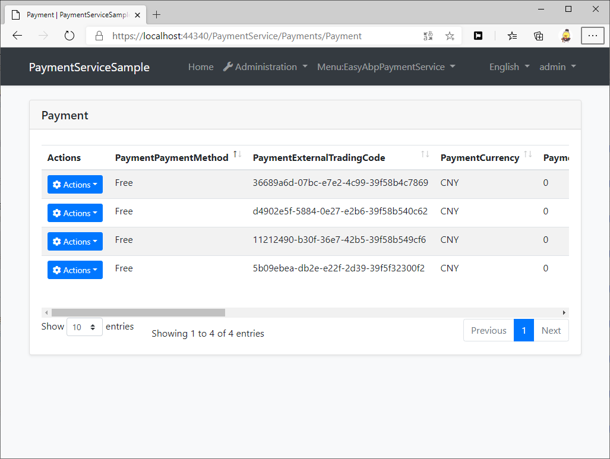

# PaymentService

[](https://www.nuget.org/packages/EasyAbp.PaymentService.Domain.Shared)
[](https://www.nuget.org/packages/EasyAbp.PaymentService.Domain.Shared)

An abp application module that provides payment service.

## Getting Started

* Install with [AbpHelper](https://github.com/EasyAbp/AbpHelper.GUI)

    Coming soon.

* Install Manually

    1. Install `EasyAbp.PaymentService.Application` NuGet package to `MyProject.Application` project and add `[DependsOn(PaymentServiceApplicationModule)]` attribute to the module.

    1. Install `EasyAbp.PaymentService.Application.Contracts` NuGet package to `MyProject.Application.Contracts` project and add `[DependsOn(PaymentServiceApplicationContractsModule)]` attribute to the module.

    1. Install `EasyAbp.PaymentService.Domain` NuGet package to `MyProject.Domain` project and add `[DependsOn(PaymentServiceDomainModule)]` attribute to the module.

    1. Install `EasyAbp.PaymentService.Domain.Shared` NuGet package to `MyProject.Domain.Shared` project and add `[DependsOn(PaymentServiceDomainSharedModule)]` attribute to the module.

    1. Install `EasyAbp.PaymentService.EntityFrameworkCore` NuGet package to `MyProject.EntityFrameworkCore` project and add `[DependsOn(PaymentServiceEntityFrameworkCoreModule)]` attribute to the module.

    1. Install `EasyAbp.PaymentService.HttpApi` NuGet package to `MyProject.HttpApi` project and add `[DependsOn(PaymentServiceHttpApiModule)]` attribute to the module.

    1. Install `EasyAbp.PaymentService.HttpApi.Client` NuGet package to `MyProject.HttpApi.Client` project and add `[DependsOn(PaymentServiceHttpApiClientModule)]` attribute to the module.

    1. Install `EasyAbp.PaymentService.MongoDB` NuGet package to `MyProject.MongoDB` project and add `[DependsOn(PaymentServiceMongoDbModule)]` attribute to the module.

    1. (Optional) If you need MVC UI, install `EasyAbp.PaymentService.Web` NuGet package to `MyProject.Web` project and add `[DependsOn(PaymentServiceWebModule)]` attribute to the module.

    1. Add `builder.ConfigurePaymentService();` to OnModelCreating method in `MyProjectMigrationsDbContext.cs`.

    1. Add EF Core migrations and update your database. See: [ABP document](https://docs.abp.io/en/abp/latest/Tutorials/Part-1?UI=MVC#add-new-migration-update-the-database).

## Usage

1. Register the Free payment method, it is used to pay with 0.00 amount:
```csharp
public override void OnApplicationInitialization(ApplicationInitializationContext context)
{
    var resolver = context.ServiceProvider.GetRequiredService<IPaymentServiceResolver>();

    resolver.TryRegisterProvider(FreePaymentServiceProvider.PaymentMethod, typeof(FreePaymentServiceProvider));
}
```

Please refer to [EasyAbp.EShop.Payments](https://github.com/EasyAbp/EShop/tree/dev/modules/EasyAbp.EShop.Payments) for more information.



## Payment Providers

* Free
* [WeChatPay](docs/WeChatPay/README.md)

## Roadmap

- [ ] More payment providers.
- [ ] Unit tests.
